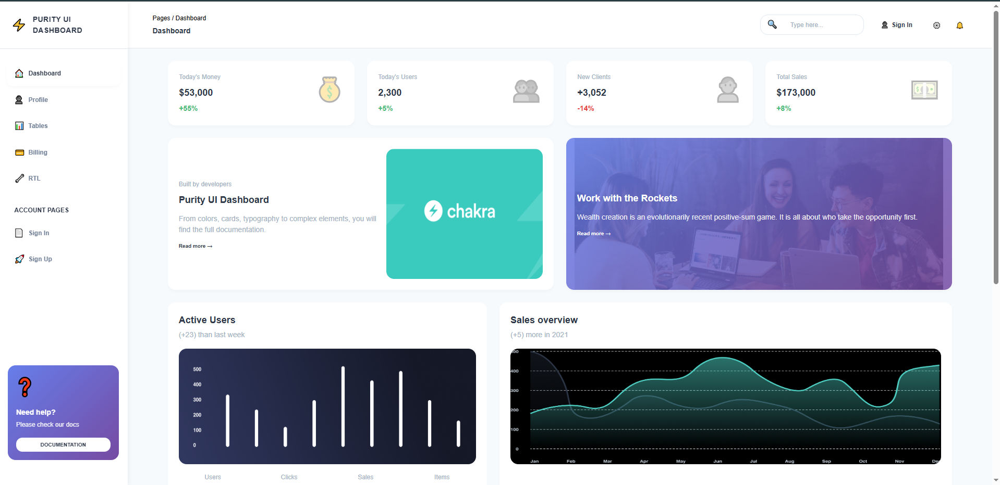
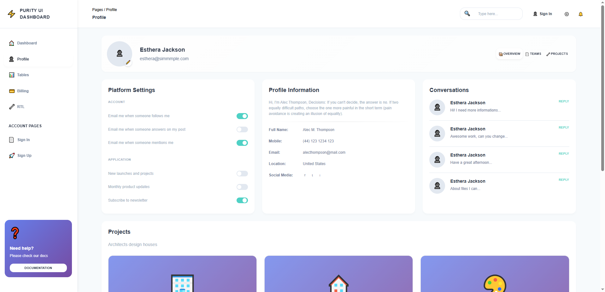

# Dashboard & Profile UI

A responsive React application featuring Dashboard and Profile pages built from Figma designs. This project demonstrates interactive UI components with state management, responsive design, and clean component architecture.



## Tech Stack

- **React** (JavaScript/JSX)
- **React Router DOM** - For client-side routing
- **CSS Modules** - For component-scoped styling
- **Vite** - Build tool and development server

## Features

### Dashboard Page
- **Stats Cards**: Display key metrics (Today's Money, Users, Clients, Sales) with trend indicators
- **Analytics Cards**: Visual representation of user activity and sales data
- **Projects List**: Interactive project cards with progress bars, budgets, and team members
- **Orders Overview**: Timeline of recent orders and activities
- **Big Cards**: Promotional cards with call-to-action buttons

### Profile Page
- **Profile Header**: User avatar, name, email with edit functionality
- **Tabs Navigation**: Overview, Teams, and Projects tabs with active state
- **Profile Information**: User details including contact information and social media links
- **Platform Settings**: Interactive toggle switches for account and application notifications
- **Conversations**: List of conversations with reply functionality
- **Projects Grid**: Project cards with "View All" buttons and create new project option

### Interactive Elements
- ✅ All buttons trigger actions (alerts/console logs)
- ✅ Toggle switches update state and reflect changes visually
- ✅ Tabs switch content sections dynamically
- ✅ Sidebar navigation with active route highlighting
- ✅ Mobile-responsive sidebar with hamburger menu
- ✅ Search functionality (console logs search terms)
- ✅ All clickable elements provide user feedback

## Responsive Design

The application is fully responsive with breakpoints at:
- **Desktop**: > 1024px - Full sidebar, multi-column layouts
- **Tablet**: 768px - 1024px - Narrower sidebar, adjusted layouts
- **Mobile**: < 768px - Collapsible sidebar, single-column layouts, hidden search

## Project Structure

```
src/
├── components/
│   ├── common/
│   │   ├── Avatar/
│   │   ├── Card/
│   │   ├── Tabs/
│   │   └── Toggle/
│   └── layout/
│       ├── Sidebar/
│       └── Topbar/
├── data/
│   ├── dashboardData.js
│   └── profileData.js
├── pages/
│   ├── Dashboard/
│   └── Profile/
├── App.jsx
├── App.css
├── index.css
└── main.jsx
```

## Setup Instructions

1. **Install Dependencies**
   ```bash
   npm install
   ```

2. **Start Development Server**
   ```bash
   npm run dev
   ```

3. **Build for Production**
   ```bash
   npm run build
   ```

4. **Preview Production Build**
   ```bash
   npm run preview
   ```

## Routes

- `/` - Redirects to `/dashboard`
- `/dashboard` - Main dashboard page
- `/profile` - User profile page
- `/tables`, `/billing`, `/rtl`, `/sign-in`, `/sign-up` - Placeholder routes (navigation only)

## Usage

### Navigation
- Use the sidebar to navigate between pages
- On mobile/tablet, click the hamburger menu (☰) in the topbar to toggle sidebar
- Active route is highlighted in the sidebar

### Dashboard
- View statistics and analytics
- Click "View" buttons on projects to see project details
- Click "Read more" on promotional cards

### Profile
- Switch between Overview, Teams, and Projects tabs
- Toggle notification settings (changes are logged to console)
- Click "REPLY" on conversations to reply
- Click "VIEW ALL" on projects to view project details
- Click the "+" card to create a new project
- Click the edit icon (✏️) to edit profile

## Assumptions & Design Decisions

1. **Mock Data**: All data is static/mock data stored in `src/data/` directory
2. **Icons**: Using emoji icons for simplicity (can be replaced with icon libraries)
3. **Colors**: Following Figma design colors (Teal-300: #4fd1c5, Gray scale, etc.)
4. **Interactions**: Buttons show alerts/console logs (no backend integration)
5. **Graphs**: Placeholder emojis for charts (can be replaced with charting libraries)
6. **Images**: Using emoji placeholders for avatars and project images
7. **Responsive Breakpoints**: Standard breakpoints at 1024px (tablet) and 768px (mobile)

## Browser Support

- Chrome (latest)
- Firefox (latest)
- Safari (latest)
- Edge (latest)

## Development Notes

- All components use CSS Modules for scoped styling
- State management uses React hooks (useState)
- No external state management library required
- All interactive elements are functional and provide feedback
- Code follows React best practices and is well-commented

## Future Enhancements

- Replace emoji icons with proper icon library (e.g., React Icons)
- Add charting library for analytics graphs
- Implement actual modals for forms (Create Project, Edit Profile)
- Add form validation
- Integrate with backend API
- Add loading states and error handling
- Implement dark mode toggle

## License

This project is created for demonstration purposes.
